# Project Context

> **Auto-generated by [code-mapper](https://github.com/your-org/code-mapper).**  
> Read this file instead of scanning source files — it captures the full structure at a fraction of the token cost.
> `sentiment_analysis` · 52 files (javascript×16, python×36) · 38 classes · 67 functions · ~7,911 source lines

---
## File Structure

```
sentiment_analysis/
├── backend/
  ├── app/
    └── __init__.py
    └── config.py
    └── main.py
    ├── models/
      └── sentiment.py
    ├── services/
      └── __init__.py
      └── analyzer.py
      └── article_filter.py
      └── bingnews.py
      └── cache.py
      └── comprehensive_analysis.py
      └── correlation.py
      └── db.py
      └── enhanced_metrics.py
      └── event_tagger.py
      └── financialjuice.py
      └── finnhub.py
      └── finviz.py
      └── googlenews.py
      └── keywords.py
      └── ner_validator.py
      └── newsapi.py
      └── secedgar.py
      └── sector_mapping.py
      └── twitter.py
      └── yahoofinance.py
    ├── utils/
      └── __init__.py
      └── text.py
  └── test_article_persistence.py
  └── test_calibration.py
  └── test_event_tagger.py
  └── test_import.py
  └── test_sector_relative.py
├── frontend/
  └── postcss.config.js
  ├── src/
    └── App.jsx
    ├── components/
      └── AnalystRatings.jsx
      └── ArticleCard.jsx
      └── HealthStatus.jsx
      └── KeywordsPanel.jsx
      └── MetricsCard.jsx
      └── PriceSentimentChart.jsx
      └── SearchForm.jsx
      └── SentimentBar.jsx
      └── SentimentGauge.jsx
      └── SentimentHistory.jsx
    └── main.jsx
    ├── services/
      └── api.js
  └── tailwind.config.js
  └── vite.config.js
├── scripts/
  ├── archive/
    └── debug_sources.py
    └── test_api.py
    └── test_msft.py
    └── test_sources.py
```

## Class Diagram

```mermaid
classDiagram
    class AnalystRatings["AnalystRatings"] {
        +recommendation: str
        +target_mean_price: Optional
        +target_high_price: Optional
        +target_low_price: Optional
    }
    class AnalystRevisionMetrics["AnalystRevisionMetrics"] {
        +velocity_7d: Optional
        +velocity_7d_pct: Optional
        +recommendation_shift: Optional
        +upgrade_count_7d: int
    }
    class AnalyzeRequest["AnalyzeRequest"] {
        +ticker: str
        +company_name: str
    }
    class ArticleSentiment["ArticleSentiment"] {
        +title: str
        +source: str
        +published_at: str
        +sentiment: SentimentLabel
    }
    class BingNewsClient["BingNewsClient"] {
        +search_news()
        +check_health()
        +__init__()
    }
    class ComprehensiveAnalysisRequest["ComprehensiveAnalysisRequest"] {
        +ticker: str
        +company_name: Optional
    }
    class ComprehensiveAnalysisResponse["ComprehensiveAnalysisResponse"] {
        +ticker: str
        +generated_at: str
        +current_data: Dict
        +deep_research: Dict
    }
    class ContrarianMetrics["ContrarianMetrics"] {
        +signal: ContrarianSignal
        +sentiment_percentile: Optional
        +confidence_threshold_met: bool
    }
    class ContrarianResult["«dataclass» ContrarianResult"] {
        +signal: ContrarianSignal
        +sentiment_percentile: Optional
        +confidence_threshold_met: bool
    }
    class ContrarianSignal["ContrarianSignal"] {
    }
    class FilterStats["FilterStats"] {
        +input: int
        +dedup_dropped: int
        +domain_dropped: int
        +title_dropped: int
    }
    class FinBERTAnalyzer["FinBERTAnalyzer"] {
        +analyze_text()
        +analyze_article()
        +analyze_articles()
        +is_loaded()
        +__init__()
    }
    class FinancialJuiceClient["FinancialJuiceClient"] {
        +get_company_news()
        +check_health()
        +__init__()
    }
    class FinnhubClient["FinnhubClient"] {
        +get_company_news()
        +get_company_profile()
        +get_quote()
        +get_basic_financials()
        +check_health()
        +__init__()
    }
    class FinvizClient["FinvizClient"] {
        +get_insider_trading()
        +get_news()
        +get_stock_screen_data()
        +check_health()
        +__init__()
    }
    class GoogleNewsClient["GoogleNewsClient"] {
        +search_news()
        +get_topic_news()
        +check_health()
        +__init__()
    }
    class HealthResponse["HealthResponse"] {
        +status: str
        +news_api: str
        +finnhub: str
        +twitter: Optional
    }
    class HistoryResponse["HistoryResponse"] {
        +ticker: str
        +snapshots: List
        +count: int
    }
    class HistorySnapshot["HistorySnapshot"] {
        +ticker: str
        +captured_at: str
        +avg_sentiment: float
        +overall_sentiment: str
    }
    class LeadLagPoint["LeadLagPoint"] {
        +offset_days: int
        +correlation: float
    }
    class NERValidationResult["«dataclass» NERValidationResult"] {
        +is_valid: bool
        +confidence: float
        +matched_entities: List
        +reason: Optional
    }
    class NERValidator["NERValidator"] {
        +validate_article()
        +validate_articles()
        +__init__()
    }
    class NewsAPIClient["NewsAPIClient"] {
        +get_company_news()
        +check_health()
        +__init__()
    }
    class PriceCorrelation["PriceCorrelation"] {
        +pearson_r: Optional
        +divergence_alert: bool
        +divergence_direction: Optional
        +lead_lag: List
    }
    class PriceDataPoint["PriceDataPoint"] {
        +date: str
        +open: float
        +high: float
        +low: float
    }
    class SECEDGARClient["SECEDGARClient"] {
        +get_company_filings()
        +get_deep_dive_filings()
        +get_latest_8k()
        +check_health()
        +__init__()
    }
    class SectorRelativeMetrics["SectorRelativeMetrics"] {
        +sector_etf: Optional
        +sector_sentiment: Optional
        +relative_sentiment: Optional
        +percentile_vs_sector: Optional
    }
    class SectorRelativeResult["«dataclass» SectorRelativeResult"] {
        +sector_etf: Optional
        +sector_sentiment: Optional
        +relative_sentiment: Optional
        +percentile_vs_sector: Optional
    }
    class SentimentLabel["SentimentLabel"] {
    }
    class SentimentMetrics["SentimentMetrics"] {
        +total_articles: int
        +positive_count: int
        +negative_count: int
        +neutral_count: int
    }
    class SentimentResponse["SentimentResponse"] {
        +ticker: str
        +company_name: str
        +overall_sentiment: SentimentLabel
        +confidence: float
    }
    class SentimentResult["«dataclass» SentimentResult"] {
        +label: str
        +score: float
        +confidence: float
    }
    class Settings["Settings"] {
        +NEWS_API_KEY: str
        +FINNHUB_API_KEY: str
        +HF_TOKEN: str
    }
    class StockPriceData["StockPriceData"] {
        +current_price: float
        +price_change: float
        +price_change_percent: float
        +history: List
    }
    class TTLCache["TTLCache"] {
        +get()
        +set()
        +delete()
        +clear()
        +size()
        +stats()
        +__init__()
    }
    class TopicKeyword["TopicKeyword"] {
        +keyword: str
        +count: int
        +avg_sentiment: float
    }
    class TwitterClient["TwitterClient"] {
        +is_configured()
        +search_tweets()
        +check_health()
        +__init__()
    }
    class YahooFinanceClient["YahooFinanceClient"] {
        +get_ticker_info()
        +get_news()
        +get_analyst_recommendations()
        +get_price_history()
        +check_health()
        +__init__()
    }
```



## Module Dependencies

```mermaid
graph TD
    App --> AnalystRatings
    App --> ArticleCard
    App --> HealthStatus
    App --> KeywordsPanel
    App --> MetricsCard
    App --> PriceSentimentChart
    App --> SearchForm
    App --> SentimentBar
    App --> SentimentGauge
    App --> SentimentHistory
    App --> api
    HealthStatus --> api
    SentimentHistory --> api
    analyzer --> article_filter
    analyzer --> config
    analyzer --> text
    article_filter --> ner_validator
    comprehensive_analysis --> yahoofinance
    debug_sources --> finviz
    debug_sources --> secedgar
    debug_sources --> yahoofinance
    enhanced_metrics --> sector_mapping
    enhanced_metrics --> sentiment
    finnhub --> config
    main --> analyzer
    main --> article_filter
    main --> bingnews
    main --> cache
    main --> correlation
    main --> enhanced_metrics
    main --> event_tagger
    main --> financialjuice
    main --> finnhub
    main --> finviz
    main --> googlenews
    main --> keywords
    main --> newsapi
    main --> secedgar
    main --> sector_mapping
    main --> sentiment
    main --> twitter
    main --> yahoofinance
    newsapi --> config
    test_event_tagger --> event_tagger
    test_sector_relative --> enhanced_metrics
    test_sector_relative --> sector_mapping
    twitter --> config
```



## Symbol Index


**`backend\app\config.py`** `python`
- `class Settings(BaseSettings)`
- `def get_settings() → Settings`

**`backend\app\main.py`** `python`
- `async def lifespan(app: FastAPI)`  — Manage application lifespan - load/unload model.
- `async def root()`  — Root endpoint.
- `async def health_check()`  — Health check endpoint.
- `async def analyze_stock(request: AnalyzeRequest, background_tasks: BackgroundTasks)`  — Analyze sentiment for a stock using news from multiple sources.
- `async def check_sentiment_alerts(tickers: list)`  — Check for major sentiment shifts (>0.3 delta) for a list of tickers.
- `async def cache_stats()`  — Return TTL cache statistics (entries, keys, TTL).
- `async def cache_invalidate(ticker: str)`  — Invalidate cached result for a specific ticker (forces fresh analysis on next ca
- `async def get_sources()`  — Get information about configured data sources.
- `async def get_sentiment_history(ticker: str, limit: int)`  — Return historical sentiment snapshots for a ticker.
- `async def comprehensive_analysis(request: ComprehensiveAnalysisRequest)`  — Run a comprehensive deep-dive report on a single ticker.

**`backend\app\models\sentiment.py`** `python`
- `class SentimentLabel(str, Enum)`
- `class ContrarianSignal(str, Enum)`
- `class PriceDataPoint(BaseModel)`
- `class StockPriceData(BaseModel)`
- `class ArticleSentiment(BaseModel)`
- `class FilterStats(BaseModel)`
- `class ContrarianMetrics(BaseModel)`
- `class SectorRelativeMetrics(BaseModel)`
- `class SentimentMetrics(BaseModel)`
- `class TopicKeyword(BaseModel)`
- `class AnalystRatings(BaseModel)`
- `class AnalystRevisionMetrics(BaseModel)`
- `class LeadLagPoint(BaseModel)`
- `class PriceCorrelation(BaseModel)`
- `class SentimentResponse(BaseModel)`
- `class AnalyzeRequest(BaseModel)`
- `class HealthResponse(BaseModel)`
- `class HistorySnapshot(BaseModel)`
- `class HistoryResponse(BaseModel)`
- `class ComprehensiveAnalysisRequest(BaseModel)`
- `class ComprehensiveAnalysisResponse(BaseModel)`

**`backend\app\services\analyzer.py`** `python`
- `«dataclass» class SentimentResult`
- `class FinBERTAnalyzer`  — Sentiment analyzer using FinBERT model from Hugging Face.
  methods: `analyze_text`, `analyze_article`, `analyze_articles`, `is_loaded`

**`backend\app\services\article_filter.py`** `python`
> Strict article matching and filtering to reduce false positives.
- `def deduplicate_articles(articles: List) → Tuple`  — Drop duplicates across sources using normalized title + URL.
- `def passes_domain_whitelist(article: Dict) → bool`  — Keyword-sourced articles must come from a trusted financial source.
- `def passes_title_relevance(article: Dict, ticker: str, company_name: str) → bool`  — Require ticker pattern OR a known company alias to appear in title
- `def get_source_weight(article: Dict) → float`  — Return a credibility multiplier (0.4–1.0) for an article based on its source dom
- `def filter_articles(articles: List, ticker: str, company_name: str, verbose: bool) → Tuple`  — Run full filter pipeline: dedup → domain whitelist → title relevance → NER valid

**`backend\app\services\bingnews.py`** `python`
> Bing News RSS client - no API key required, no rate limits.
- `class BingNewsClient`  — Bing News RSS client for fetching stock-related news.
  methods: `search_news`, `check_health`

**`backend\app\services\cache.py`** `python`
> TTL cache for sentiment analysis results.
- `class TTLCache`  — Thread-safe in-memory cache with per-entry TTL.
  methods: `get`, `set`, `delete`, `clear`, `size`, `stats`

**`backend\app\services\comprehensive_analysis.py`** `python`
> Comprehensive ticker analysis for deep-dive research reports.
- `def get_current_data(ticker: str) → Dict`  — Retrieve live market data and 52-week range positioning.
- `def get_deep_research(ticker: str) → Dict`  — Pull financials, balance sheet, competitors, risks, and growth outlook.
- `def get_news_check(ticker: str, yahoo_client: YahooFinanceClient) → Dict`  — Surface recent material news and developments.
- `def run_comprehensive_analysis(ticker: str, yahoo_client: YahooFinanceClient) → Dict`  — Run all three sections and return a unified report.

**`backend\app\services\correlation.py`** `python`
> Price–sentiment correlation metrics.
- `def compute_correlation(price_history: List, daily_sentiment: Dict) → Dict`  — Compute price–sentiment correlation metrics.

**`backend\app\services\db.py`** `python`
> SQLite-based historical sentiment tracking.
- `def init_db() → None`  — Create tables and indexes if they don't exist.
- `def save_snapshot(ticker: str, avg_sentiment: float, overall_sentiment: str, confidence: float) → None`  — Persist one analysis snapshot for a ticker.
- `def save_analyst_snapshot(ticker: str, recommendation: Optional, target_mean: Optional, num_analysts: int) → None`  — Persist analyst rating snapshot for revision velocity tracking.
- `def get_analyst_history(ticker: str, days: int) → List`  — Return analyst snapshots for ticker from the last *days* days, newest first.
- `def prune_old_snapshots(days: int) → int`  — Delete sentiment_snapshots older than *days* days. Returns number of rows delete
- `def get_history(ticker: str, limit: int) → List`  — Return the last *limit* snapshots for *ticker*, newest first.
- `def save_articles(ticker: str, articles: List) → int`  — Persist analyzed articles for *ticker*, deduped on (ticker, url_hash).
- `def prune_old_articles(days: int) → int`  — Delete article_sentiments rows older than *days* days (by captured_at).
- `def get_articles(ticker: str, days: int) → List`  — Return persisted articles for *ticker* captured in the last *days* days.
- `def prune_old_analyst(days: int) → int`  — Delete analyst_history rows older than *days* days. Returns rows deleted.

**`backend\app\services\enhanced_metrics.py`** `python`
> Enhanced sentiment metrics computation.
- `«dataclass» class ContrarianResult`
- `«dataclass» class SectorRelativeResult`
- `def compute_analyst_revision_velocity(snapshots: List) → AnalystRevisionMetrics`  — Compute analyst revision velocity from a list of analyst_history snapshots.
- `def compute_contrarian_signal(avg_sentiment: float, confidence: float, total_articles: int, percentile_threshold: float) → ContrarianResult`  — Compute contrarian signal based on sentiment extremes.
- `def compute_sector_relative_sentiment(ticker: str, ticker_sentiment: float, sector_sentiments: Dict) → SectorRelativeResult`  — Compute sector-relative sentiment metrics.
- `def create_contrarian_metrics(result: ContrarianResult) → ContrarianMetrics`  — Convert ContrarianResult to ContrarianMetrics model.
- `def create_sector_relative_metrics(result: SectorRelativeResult) → SectorRelativeMetrics`  — Convert SectorRelativeResult to SectorRelativeMetrics model.

**`backend\app\services\event_tagger.py`** `python`
> Phase 4 Step 1 (A1): keyword-based event classification for news articles.
- `def classify_event(title: str, summary: str) → str`  — Classify a news article into a coarse event category.
- `def classify_event_batch(articles: List) → None`  — In-place: set article['event_type'] for each article in *articles*.

**`backend\app\services\financialjuice.py`** `python`
> FinancialJuice RSS client - no API key required.
- `class FinancialJuiceClient`  — FinancialJuice public RSS feed client.
  methods: `get_company_news`, `check_health`

**`backend\app\services\finnhub.py`** `python`
- `class FinnhubClient`
  methods: `get_company_news`, `get_company_profile`, `get_quote`, `get_basic_financials`, `check_health`

**`backend\app\services\finviz.py`** `python`
> Finviz client for insider trading and analyst ratings.
- `class FinvizClient`  — Finviz client using Playwright headless browser.
  methods: `get_insider_trading`, `get_news`, `get_stock_screen_data`, `check_health`

**`backend\app\services\googlenews.py`** `python`
> Google News RSS client - no API key required.
- `class GoogleNewsClient`  — Google News RSS client for fetching stock-related news.
  methods: `search_news`, `get_topic_news`, `check_health`

**`backend\app\services\keywords.py`** `python`
> Keyword / topic extraction from analyzed articles.
- `def extract_keywords(articles: List, top_n: int, min_count: int) → List`  — Extract top *top_n* keywords from article titles + descriptions.

**`backend\app\services\ner_validator.py`** `python`
> Named Entity Recognition (NER) validation for article disambiguation.
- `«dataclass» class NERValidationResult`
- `class NERValidator`  — Lightweight NER validator for financial news articles.
  methods: `validate_article`, `validate_articles`
- `def get_validator() → NERValidator`  — Get or create the NER validator singleton.

**`backend\app\services\newsapi.py`** `python`
- `class NewsAPIClient`
  methods: `get_company_news`, `check_health`

**`backend\app\services\secedgar.py`** `python`
> SEC EDGAR API client for fetching company filings.
- `class SECEDGARClient`  — SEC EDGAR client for fetching company filings and financial reports.
  methods: `get_company_filings`, `get_deep_dive_filings`, `get_latest_8k`, `check_health`

**`backend\app\services\sector_mapping.py`** `python`
> Sector mapping utility for sector-relative sentiment analysis.
- `def get_sector_etf(ticker: str) → Optional`  — Get the sector ETF for a given ticker.
- `def get_sector_name(etf: str) → str`  — Get the human-readable sector name for an ETF.
- `def get_all_sector_etfs() → List`  — Get all sector ETF symbols.
- `def get_tickers_in_sector(etf: str) → List`  — Get all tickers mapped to a sector ETF.
- `def is_sector_etf(ticker: str) → bool`  — Check if a ticker is a sector ETF.

**`backend\app\services\twitter.py`** `python`
> Twitter/X API v2 client for sentiment analysis.
- `class TwitterClient`  — Twitter/X API v2 client for fetching stock-related tweets.
  methods: `is_configured`, `search_tweets`, `check_health`

**`backend\app\services\yahoofinance.py`** `python`
> Yahoo Finance client using yfinance library.
- `class YahooFinanceClient`  — Yahoo Finance client for stock data and news.
  methods: `get_ticker_info`, `get_news`, `get_analyst_recommendations`, `get_price_history`, `check_health`

**`backend\app\utils\text.py`** `python`
- `def clean_text(text: str) → str`  — Clean and normalize text for analysis.
- `def truncate_text(text: str, max_length: int) → str`  — Truncate text to a maximum length while preserving sentence boundaries.
- `def deduplicate_articles(articles: List) → List`  — Remove duplicate articles based on title similarity.
- `def extract_keywords(text: str, max_keywords: int) → List`  — Extract simple keywords from text (can be enhanced with NLP).

**`backend\test_article_persistence.py`** `python`
> Standalone test for Phase 4 Step 1 (A0a): article persistence layer.
- `def check(name: str, condition: bool, detail: str)`
- `def make_article(i: int, title_suffix: str) → dict`
- `def test_save_and_dedup()`
- `def test_purge_boundary()`
- `def test_prune_old_analyst()`

**`backend\test_calibration.py`** `python`
> Standalone test for Phase 4 Step 1 (A5): FinBERT confidence calibration
- `def check(name: str, condition: bool, detail: str)`
- `def test_temperature_softens_distribution()`
- `def test_temperature_env_var_wiring()`
- `def test_relevance_threshold_volume_note()`

**`backend\test_event_tagger.py`** `python`
> Standalone test for Phase 4 Step 1 (A1): keyword-based event tagger.
- `def check(name: str, condition: bool, detail: str)`
- `def test_classify_event_fixtures()`
- `def test_classify_event_batch_inplace()`
- `def test_ordering_specificity()`

**`backend\test_sector_relative.py`** `python`
> Standalone test for Phase 4 Step 1 (A0b): sector-relative sentiment in the
- `def check(name: str, condition: bool, detail: str)`
- `def test_populated_when_etf_snapshot_present()`
- `def test_none_when_etf_snapshot_absent()`
- `def test_none_when_no_sector_mapping()`

**`scripts\archive\test_sources.py`** `python`
> Diagnostic test for Yahoo Finance, Finviz, and SEC EDGAR sources.
- `def test_sources()`  — Test individual news sources.